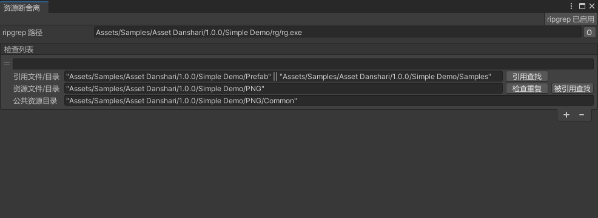
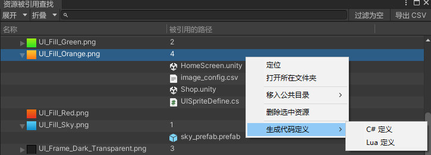
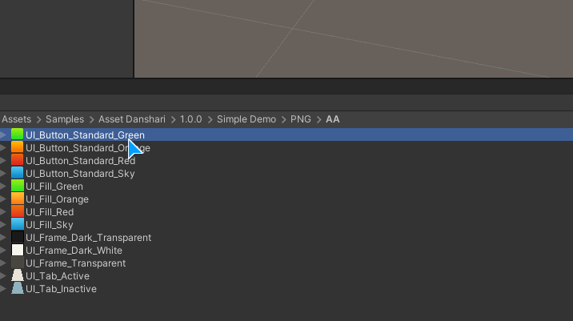

# Unity Asset Danshari 资源断舍离

UnityAssetDanshari 是一个 Unity 资源清理重复以及引用被引用查找工具。内核使用 ripgrep 文本搜索工具，使得资源查找速度飞快。
UnityAssetDanshari is a Unity merge duplicated assets and find reference tool.

## 背景
在游戏制作过程，随着资源越来越多，可能存在重复的资源，也需要删除不被使用的资源，但是如果使用 Unity 的 API 去查找引用关系将会很耗时间，另外，资源都是对应使用的，比如 UI 图片只在 UI 界面上进行引用，所以不需要去查找其他地方是否引用到。

## 安装

- 通过【Package Manager】包管理器，添加git URL地址：https://github.com/akof1314/UnityAssetDanshari.git

## 首次使用

提前准备 ripgrep 的二进制文件[https://github.com/BurntSushi/ripgrep/releases](https://github.com/BurntSushi/ripgrep/releases)， 也可以直接使用示例工程自带的 Windows 版二进制文件。



工具入口为菜单栏【美术工具/资源断舍离】，如果导入了示例工程，则打开会包含默认的配置项。点击右上角的`ripgrep`按钮，可以进行配置`ripgrep路径`。如果没有配置`ripgrep路径`则会使用默认的普通文件搜索方式，速度相当慢。

## 默认配置项

工具配置文件保存在`"UserSettings/AssetDanshariSetting.asset"`，为了能够团队默认能够有一样的配置内容，可以绑定创建配置事件。

```csharp
[InitializeOnLoadMethod]
private static void InitOnLoad()
{
    AssetDanshariHandler.onCreateSetting += OnCreateSetting;
    AssetDanshariHandler.onDependenciesLoadDataMore += OnDependenciesLoadDataMore;
    AssetDanshariHandler.onDependenciesContextDraw += OnDependenciesContextDraw;
}
```

用户自定义配置事件，可以指定rg到工程的统一外部工具路径。

```csharp
private static AssetDanshariSetting OnCreateSetting()
{
    var setting = ScriptableObject.CreateInstance<AssetDanshariSetting>();
    setting.ripgrepPath = "Assets/Samples/Asset Danshari/1.0.0/Simple Demo/rg/rg.exe";
    setting.assetReferenceInfos.Add(new AssetDanshariSetting.AssetReferenceInfo()
    {
        referenceFolder = "\"Assets/Samples/Asset Danshari/1.0.0/Simple Demo/Prefab\" || \"Assets/Samples/Asset Danshari/1.0.0/Simple Demo/Samples\"",
        assetFolder = "\"Assets/Samples/Asset Danshari/1.0.0/Simple Demo/PNG\"",
        assetCommonFolder = "\"Assets/Samples/Asset Danshari/1.0.0/Simple Demo/PNG/Common\""
    });
    return setting;
}
```

## 检查列表

列表按资源的使用环境进行分组。
- 将`Project`窗口里的文件或文件夹路径拖到目录框
- 多路径方式可以多选后再拖入，也可以按住`Ctrl`进行添加
- 【公共资源目录】是用来放公共资源的路径，比如 UI 图片资源存在被多个界面引用的时候，可以快捷操作移动资源到公共目录

## 引用查找

对【引用目录】下的每个资源进行检查是否引用到了【资源目录】下的资源，比如 UI 界面预制引用 UI 图片。


双击项，可以自动在【Project】窗口定位到资源。

## 被引用查找

对【资源目录】下的每个资源进行分析，看是否被【引用目录】下的资源进行引用，比如 UI 图片被哪些 UI 界面进行引用。


【删除选中资源】菜单项功能，是直接对资源进行删除，当发现没有被使用到时，可以这样快捷删除资源。

右上角【过滤为空】按钮，可以过滤显示没有被使用的资源，方便快速查看。

## 检查重复

对资源文件进行逐块 Hash128 检查重复，再对重复的资源进行操作。


【资源被引用查找】菜单项功能，是在【被引用查找】窗口里定位到此资源的使用情况，方便进行决定保留还是删除，注意，需要先打开了【被引用查找】窗口才可以定位到。

【仅使用此资源，其余删除】菜单项功能，将会删除其余重复的资源，并且将所有引用到这些删除资源的地方都改成引用保留的那一个。

当美术对同一资源进行切图两次，会导致文件 Hash128 值不一样，就无法被工具所检测到。出现这种情况的时候，肉眼发现到两个资源其实是一样的，可以在这个窗口右上角点击【手动添加】按钮。


手动进行添加资源路径，将资源文件拖动到文本框，再点击【确定】。就会自动定位到新增的数据，接着就可以按处理重复资源一样进行操作。

## 扩展被引用来源



资源不止被另外的资源直接引用，还可能配置在表里、代码里进行动态使用，在这种情况下，可以绑定`onDependenciesLoadDataMore`事件，对传入的资源路径进行判别处理，参照示例工程代码。

## API 调用

每次需要拖曳文件/目录到窗口可能会觉得不方便，或者想要集成到自己的工具里，可以使用公开的 API，调用三个不同的窗口。

```csharp
/// <summary>
/// 显示引用查找窗口
/// </summary>
/// <param name="refPaths">引用的文件、目录集合</param>
/// <param name="resPaths">资源的文件、目录集合</param>
/// <param name="commonPaths">公共资源目录集合</param>
public static void DisplayReferenceWindow(string refPaths, string resPaths, string commonPaths = "")

/// <summary>
/// 显示被引用查找窗口
/// </summary>
public static void DisplayDependenciesWindow(string refPaths, string resPaths, string commonPaths = "")

/// <summary>
/// 显示重复资源检查窗口
/// </summary>
public static void DisplayDuplicateWindow(string refPaths, string resPaths, string commonPaths = "")
```



示例工程举例实现右键资源文件来查看被引用情况。

```csharp
[MenuItem("Assets/查找该资源的被引用")]
private static void FindReferenceAll()
{
    string[] paths = new string[Selection.objects.Length];
    for (var i = 0; i < Selection.objects.Length; i++)
    {
        var o = Selection.objects[i];
        paths[i] = AssetDatabase.GetAssetPath(o);
    }

    AssetDanshariWindow.DisplayDependenciesWindow(
        AssetDanshariUtility.PathArrayToStr(new []{"Assets"}),
        AssetDanshariUtility.PathArrayToStr(paths));
}
```

## 当前限制

二进制配置文件，如：Lighting data, Terrain data 之类，无法查找其引用资源关系。